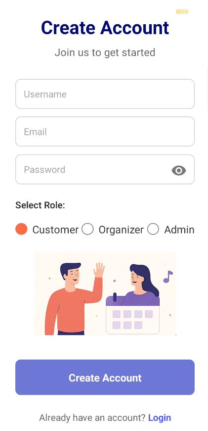

# event-booking-app-react-native

# 🎫 Ticket Booking App for Movies & Concerts

A full-stack mobile application for booking event tickets, built with:

- **Frontend**: React Native
- **Backend**: Node.js + Express.js
- **Database**: MongoDB (Mongoose)
- **Payment Gateway**: Stripe

## 📱 Features

- User signup/login with role-based access
- Event creation and search
- Dynamic seat selection and booking
- Profile management and ticket history
- Admin panel for event and user management

## 📷 Screenshots
## Screenshots

### Home Screen

### Ticket Screen

### 🔐 Signup Screen

- Signup | Login | Forgot Password
- Event Creation | Seat Selection
- Ticket Summary | Manage Events/Users

## 🛠️ Tech Stack

| Technology     | Purpose                     |
|----------------|-----------------------------|
| React Native   | Mobile App UI               |
| Node.js        | Backend Logic               |
| Express.js     | API Routing                 |
| MongoDB        | Database                    |
| Mongoose       | ODM for MongoDB             |
| Stripe         | Payment Integration         |

## 🧑‍💻 Authors

- Danial A [DC2022BTE0032]

